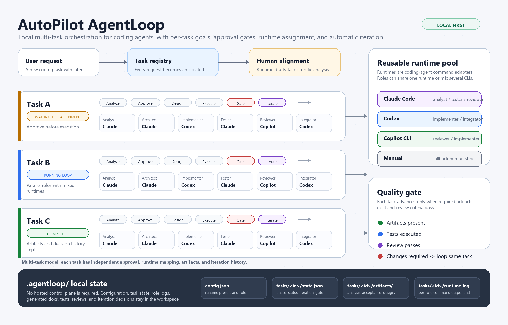

# AgentLoop

AgentLoop is a local, file-backed orchestration layer for coding agents. It helps a user turn a coding task into a controlled loop:

1. analyze the task
2. generate task-specific acceptance criteria
3. wait for human approval
4. design, implement, test, and review
5. iterate automatically until the gate passes or the iteration limit is reached

It is agent-agnostic. You can use Claude Code, Codex, GitHub Copilot CLI, or a manual runtime if the command can read prompts and write files in the workspace.

**Runtime == Coding agent run**

## Capability Map



AgentLoop keeps orchestration local: task state, runtime config, generated artifacts, review decisions, and iteration history all stay in `.agentloop/`.

## Quick Start

Run these commands from the repository root.

```powershell
python -m agentloop init --detect-runtimes
python -m agentloop runtime list
```

Pick one detected runtime and assign it to every role. For example, with Claude Code:

```powershell
python -m agentloop runtime assign-all claude-code
python -m agentloop runtime verify claude-code --timeout-seconds 120
```

Or with Codex:

```powershell
python -m agentloop runtime assign-all codex
python -m agentloop runtime verify codex --timeout-seconds 120
```

If detection misses a runtime, add a built-in preset first:

```powershell
python -m agentloop runtime add-preset claude-code --replace
python -m agentloop runtime add-preset codex --replace
python -m agentloop runtime add-preset manual --replace
python -m agentloop runtime list
```

## Run Your First Task

Start with a small task that can be verified by tests.

```powershell
python -m agentloop start "实现 doctor 命令，检查 workspace 状态并输出 PASS/FAIL"
```

`start` creates a task and asks the analyst runtime to produce task-specific analysis and acceptance criteria. It stops before implementation so the user can review the goal.

List tasks:

```powershell
python -m agentloop tasks
```

Open the generated task artifacts:

```powershell
Get-Content .agentloop\tasks\<task_id>\artifacts\analysis.md
Get-Content .agentloop\tasks\<task_id>\artifacts\acceptance.md
```

Approve only after the analysis and acceptance criteria match what you want:

```powershell
python -m agentloop approve --task-id <task_id>
```

Then run the execution loop:

```powershell
python -m agentloop run --task-id <task_id>
```

AgentLoop will run the configured roles, execute the quality gate, and iterate when review says changes are required.

## Daily Commands

```powershell
python -m agentloop status
python -m agentloop tasks
python -m agentloop status --task-id <task_id>
python -m agentloop cancel --task-id <task_id>
python -m agentloop tasks delete <task_id>
python -m agentloop tasks delete-all
```

Runtime commands:

```powershell
python -m agentloop runtime detect
python -m agentloop runtime list
python -m agentloop runtime assign analyst claude-code
python -m agentloop runtime assign implementer codex
python -m agentloop runtime assign-all claude-code
python -m agentloop runtime verify claude-code --timeout-seconds 120
```

Per-task config commands:

```powershell
python -m agentloop tasks config show --task-id <task_id>
python -m agentloop tasks config set --task-id <task_id> max_iterations 5
python -m agentloop tasks config set --task-id <task_id> --json test_commands '["python -m unittest discover -s tests"]'
python -m agentloop tasks config clear --task-id <task_id>
```

## Where Files Live

```text
.agentloop/
  config.json                 global runtime and workflow config
  tasks/
    <task_id>/
      state.json              task lifecycle state
      config.json             optional per-task overrides
      artifacts/              analysis, acceptance, design, tests, review output
```

Important generated artifacts usually include:

```text
analysis.md
acceptance.md
acceptance.json
design.md
test_plan.md
review.md
quality_gate.json
```

## Recommended New-User Flow

1. Run `python -m agentloop init --detect-runtimes`.
2. Run `python -m agentloop runtime list` and confirm at least one real runtime is available.
3. Run `python -m agentloop runtime assign-all <runtime>`.
4. Run `python -m agentloop runtime verify <runtime> --timeout-seconds 120`.
5. Start a small task with clear testable output.
6. Review `analysis.md` and `acceptance.md` before approving.
7. Run the task and inspect generated artifacts after completion.

## Troubleshooting

If all roles still show `manual`, runtime detection found commands but no role has been assigned yet. Run:

```powershell
python -m agentloop runtime assign-all claude-code
```

If a Chinese task fails with encoding errors on Windows, make sure you are running the current code. AgentLoop uses UTF-8 subprocess I/O for runtime prompts.

If a task is stuck waiting for approval, either approve or cancel it:

```powershell
python -m agentloop approve --task-id <task_id>
python -m agentloop cancel --task-id <task_id>
```

If you want to restart from zero:

```powershell
python -m agentloop tasks delete-all
```

## Full Documentation

See [docs/agentloop-user-guide.md](docs/agentloop-user-guide.md) for the complete user guide, including runtime presets, per-task overrides, task locks, batch operations, and the detailed lifecycle.


